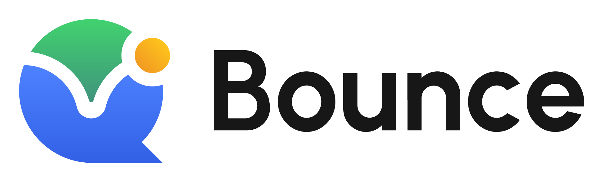
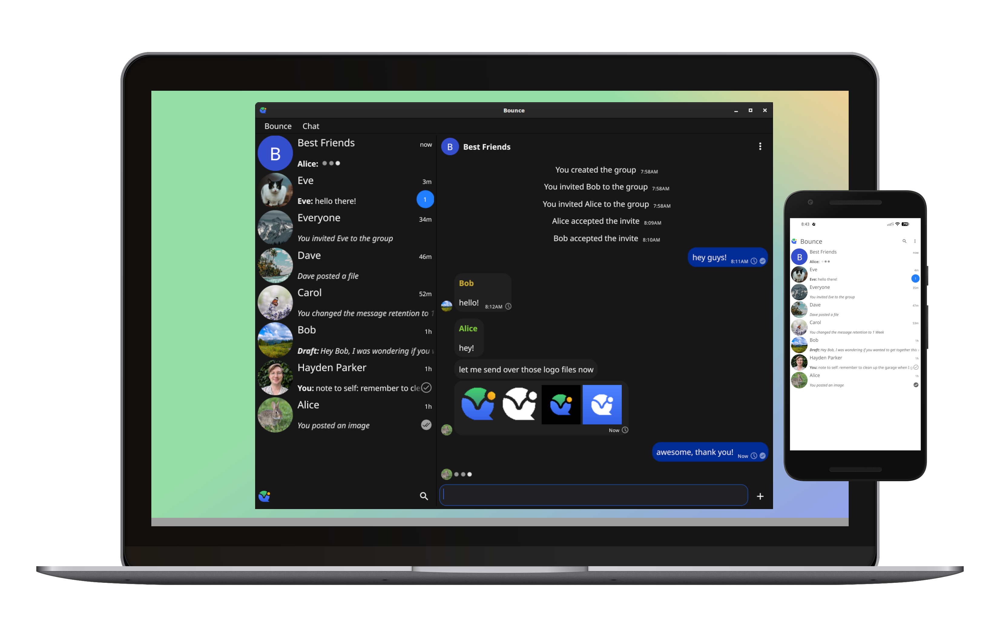

  <picture>
    <source media="(prefers-color-scheme: dark)" srcset="ui/assets/logo_dark.png">
    <source media="(prefers-color-scheme: light)" srcset="ui/assets/logo.png">
    
  </picture>

Bounce is a distributed group chat application that protects metadata, with a familiar look and feel.

  

## Design Overview

Each instance of Bounce includes a Tor hidden service, and all connections between devices occur over Tor.  Users can own multiple devices, including encrypted devices that do not have access to the message contents.  Users add contacts by scanning a code on the other person's device, or by meeting them in a group, there is no global namespace of all users.  Messages are scoped to their user or group, and gossiped between devices that are in scope and online.  Devices coming online have an efficient way to catch up.  Group states (name, admin status, etc) can survive a bad actor attempting to mess with history, so long as the majority of users are honest.  The UI is built using [Fyne](https://github.com/fyne-io/fyne).  For more details, see the [goals](docs/goals.md) and [design document](docs/design.md).

## Status

Things should be working pretty reliably, please open an issue if a feature in the UI is not behaving as expected.  Bounce has not been audited by a third party yet, and should be considered experimental.

|Platform|Status|Notes|
|---|---|---|
|Linux|✅|Fully supported|
|macOS|✅|Fully supported|
|Windows|✅|Fully supported|
|Android|✅|Fully supported, however there currently are performance issues.|
|iOS|⛔|iOS does not allow apps to run in the background.  Implementing Bounce on iOS will require a light client that receives notifications from another instance of Bounce via APNs, and reaches out to that instance to send messages.  This has not been planned yet, and would change the privacy model around metadata protection.|

For information on what's coming, see the [next steps](docs/next_steps.md) document.

## Installation

### Binary Releases

* Visit the [Releases](https://github.com/bounce-chat/bounce/releases/) page to download the latest binaries.
* Arch users can install [bounce](https://aur.archlinux.org/packages/bounce) or [bounce-bin](https://aur.archlinux.org/packages/bounce-bin) from the AUR.
* The best way to install Bounce on Android is with [Obtanium](https://github.com/ImranR98/Obtainium).

### Building from source

Bounce uses submodules, and should be cloned with:

`git clone --recurse-submodules git@github.com:bounce-chat/bounce.git`

#### Desktop

Development builds of the desktop app can be built on linux and macOS with `go build`.  The first build will take a while as it compiles [go-libtor](https://github.com/bounce-chat/go-libtor).  Windows is cross-compiled on linux using mingw32 by running `make windows`.

#### Android

Android is built on linux and requires `dex2jar`, `gomobile`, and `gradle`.  Current build scripts have opinions about the location of the Android SDK that might not be appropriate for all environments.

The forked fyne tools binary must first be built with `cd fyne-tools/cmd/fyne && go build`

Run `make android` to create `Bounce.apk`, a debuggable development build.

## License

Copyright 2026 Hayden Parker.  Bounce is licensed under the MIT license unless otherwise specified.  Design assets are licensed under CC BY-NC-ND.
